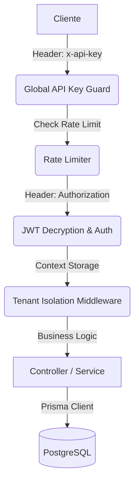

# 📖 Guía Técnica y Referencia de API - Exelixi Nexus

Esta documentación detalla el funcionamiento interno, los flujos de datos y la referencia completa de los endpoints del sistema **Exelixi Nexus**.

---

## 🏗️ Arquitectura y Flujo de Peticiones

### 1. El Viaje de una Petición



---

## 🔐 Seguridad y Autenticación

### Encriptación de Tokens (AES-256-CBC)

Los JWT no viajan en texto plano. Se cifran usando una llave de 32 bytes (`ENCRYPTION_KEY`). Esto evita que el contenido del token sea visible en herramientas de inspección si no se posee la llave.

---

## 📡 Referencia Detallada de Endpoints y Lógica de Negocio

### 1. Módulo: Autenticación (`/api/auth`)

#### `POST /login`

- **¿Qué hace?**: Autentica al usuario contra la base de datos, valida que la empresa esté activa y genera un token de sesión.
- **Lógica**: La contraseña se verifica mediante `bcrypt`. El token resultante se encripta simétricamente para proteger la privacidad del usuario incluso si el tráfico es interceptado.
- **Response Example**:
  ```json
  { "token": "...", "user": { "id": 1, "nombre": "Admin", "empresaId": 1 } }
  ```

#### `GET /me`

- **¿Qué hace?**: Recupera el estado actual de la sesión del usuario.
- **Lógica**: Es vital para el frontend, ya que devuelve no solo el perfil, sino la **Matriz de Permisos** actualizada. Esto permite al cliente habilitar o deshabilitar botones y vistas en tiempo real según el rol del usuario.

---

### 2. Módulo: Empresas / Tenants (`/api/companies`)

#### `POST /`

- **¿Qué hace?**: Registra un nuevo cliente (Empresa) en el sistema SaaS.
- **Lógica**: Inicializa la estructura base de la empresa. Por defecto, las empresas se crean en estado `activo`.

#### `POST /toggle-module`

- **¿Qué hace?**: Gestiona el catálogo de funcionalidades (módulos) contratados por una empresa.
- **Lógica**: Al activar un módulo, este se vuelve visible para la configuración de Roles de esa empresa. Si se desactiva, ningún usuario de esa empresa podrá acceder a dicha funcionalidad, independientemente de sus permisos.

---

### 3. Módulo: Usuarios (`/api/users`)

#### `POST /`

- **¿Qué hace?**: Crea un nuevo colaborador dentro de una empresa.
- **Lógica**: El usuario debe estar obligatoriamente vinculado a un `roleId` válido de la misma empresa. El sistema hace un hash automático de la contraseña antes de guardarla.

#### `PATCH /:id/status`

- **¿Qué hace?**: Activa o desactiva a un usuario (**Soft Delete**).
- **Lógica**: En lugar de borrar el registro (lo cual rompería la integridad de auditorías y logs), se marca como inactivo. Un usuario inactivo no puede generar nuevos tokens de sesión.

---

### 4. Módulo: Roles y Permisos (`/api/roles`)

#### `GET /matrix/:roleId`

- **¿Qué hace?**: Genera un mapa completo de permisos para un rol específico.
- **Lógica**: Cruza la tabla de módulos activos de la empresa con los permisos granulares asignados al rol. Es la herramienta principal para la interfaz de administración de permisos.

#### `POST /permissions`

- **¿Qué hace?**: Define las capacidades CRUD del rol.
- **Lógica**: Utiliza una **transacción de base de datos** para limpiar permisos antiguos y asignar los nuevos de forma atómica, garantizando que el rol nunca quede en un estado inconsistente si la operación falla.

---

### 5. Módulo: Gestión de Módulos (`/api/modules`)

#### `POST /submodule`

- **¿Qué hace?**: Añade granularidad a un módulo principal.
- **Lógica**: Permite crear secciones específicas (ej: Módulo "Recursos Humanos" -> Submódulo "Nómina"). Los submódulos heredan la visibilidad del módulo padre pero tienen sus propios permisos CRUD.

---

## 📡 Observabilidad y Diagnóstico

### Trazabilidad con `requestId`

Cada petición HTTP es marcada con un UUID único. Si un endpoint falla, el sistema loguea el error junto con este ID en **Sentry** y en los archivos de log locales.
**Propósito**: Permite correlacionar un error reportado por un usuario con la línea exacta de código que falló en el servidor.

---

👉 _Para dudas adicionales, consulta la documentación Swagger en el endpoint `/api-docs`._
