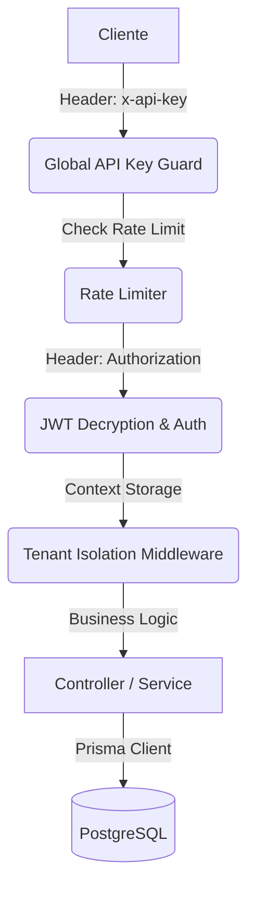

# 📖 Guía Técnica y Referencia de API - Exelixi Nexus

Esta documentación detalla el funcionamiento interno, los flujos de datos y la referencia completa de los endpoints del sistema **Exelixi Nexus**.

---

## 🏗️ Arquitectura y Flujo de Peticiones

### 1. El Viaje de una Petición



### 2. Aislamiento Multi-tenant

- **Garantía**: Todas las consultas vía Prisma incluyen automáticamente el filtro de `empresaId`. Ningún usuario puede ver datos de otra empresa.

---

## 🔐 Seguridad y Autenticación

### Encriptación de Tokens (AES-256-CBC)

Los JWT se cifran usando una llave de 32 bytes (`ENCRYPTION_KEY`). Esto evita que el contenido del token sea visible en herramientas de inspección.

---

## 📡 Referencia Detallada de Endpoints

### 1. Módulo: Autenticación (`/api/auth`)

#### `POST /login`

- **Body**: `{ "email": "...", "password": "..." }`
- **Response Example**:
  ```json
  { "token": "...", "user": { "id": 1, "nombre": "Admin", "empresaId": 1 } }
  ```

#### `GET /me`

- **Response Example**:
  ```json
  {
    "id": 1,
    "nombre": "Admin",
    "permissions": [{ "moduloId": 1, "nombre": "Ventas", "canRead": true }]
  }
  ```

#### `POST /change-password`

- **Body**: `{ "currentPassword": "...", "newPassword": "..." }`
- **Response Example**:
  ```json
  { "success": true, "message": "Contraseña actualizada" }
  ```

---

### 2. Módulo: Empresas / Tenants (`/api/companies`)

#### `GET /`

- **Response Example**:
  ```json
  [{ "id": 1, "nombre": "Empresa A", "rif": "J-123" }]
  ```

#### `POST /`

- **Body**: `{ "nombre": "...", "rif": "...", "tipo": "CLIENTE" }`
- **Response Example**:
  ```json
  { "success": true, "data": { "id": 10, "nombre": "Acme" } }
  ```

#### `GET /:id` | `PUT /:id`

- **Response Example**:
  ```json
  { "id": 1, "nombre": "Acme Corp", "rif": "J-123" }
  ```

#### `DELETE /:id`

- **Response Example**:
  ```json
  { "success": true, "message": "Empresa desactivada" }
  ```

#### `POST /toggle-module`

- **Body**: `{ "empresaId": 1, "moduloId": 5, "active": true }`
- **Response Example**:
  ```json
  { "success": true, "data": { "empresaId": 1, "moduloId": 5, "activo": true } }
  ```

---

### 3. Módulo: Usuarios (`/api/users`)

#### `GET /`

- **Response Example**:
  ```json
  [{ "id": 5, "nombre": "Juan", "email": "juan@test.com", "role": "Admin" }]
  ```

#### `POST /`

- **Body**: `{ "email": "...", "nombre": "...", "roleId": 10, "password": "..." }`
- **Response Example**:
  ```json
  { "id": 50, "nombre": "Juan", "email": "juan@test.com" }
  ```

#### `PUT /:id`

- **Body**: `{ "nombre": "..." }`
- **Response Example**:
  ```json
  { "id": 50, "nombre": "Juan Modificado" }
  ```

#### `PATCH /:id/status`

- **Response Example**:
  ```json
  {
    "success": true,
    "message": "Estado actualizado",
    "data": { "activo": false }
  }
  ```

---

### 4. Módulo: Roles y Permisos (`/api/roles`)

#### `GET /`

- **Response Example**:
  ```json
  [{ "id": 1, "nombre": "Administrador" }]
  ```

#### `POST /`

- **Body**: `{ "nombre": "Nuevo Rol" }`
- **Response Example**:
  ```json
  { "id": 10, "nombre": "Nuevo Rol" }
  ```

#### `PUT /:id` | `DELETE /:id`

- **Response Example**:
  ```json
  { "success": true, "message": "Operación exitosa" }
  ```

#### `GET /matrix/:roleId`

- **Response Example**:
  ```json
  [{ "moduloId": 1, "nombre": "Ventas", "canRead": true, "submodulos": [] }]
  ```

#### `POST /permissions`

- **Body**: `{ "roleId": 5, "permissions": [...] }`
- **Response Example**:
  ```json
  { "success": true, "message": "Matriz actualizada" }
  ```

---

### 5. Módulo: Gestión de Módulos (`/api/modules`)

#### `GET /` | `GET /all`

- **Response Example**:
  ```json
  [
    {
      "id": 1,
      "nombre": "Ventas",
      "submodulos": [{ "id": 10, "nombre": "Facturación" }]
    }
  ]
  ```

#### `POST /` | `PUT /:id` | `DELETE /:id`

- **Response Example**:
  ```json
  { "success": true, "data": { "id": 1, "nombre": "Modulo" } }
  ```

#### `POST /submodule`

- **Body**: `{ "moduloId": 1, "nombre": "Sub-A" }`
- **Response Example**:
  ```json
  { "success": true, "data": { "id": 20, "nombre": "Sub-A" } }
  ```

#### `PUT /submodule/:id` | `DELETE /submodule/:id`

- **Response Example**:
  ```json
  { "success": true, "message": "Submódulo actualizado/eliminado" }
  ```

---

👉 _Consulte `/api-docs` para especificaciones técnicas adicionales._
