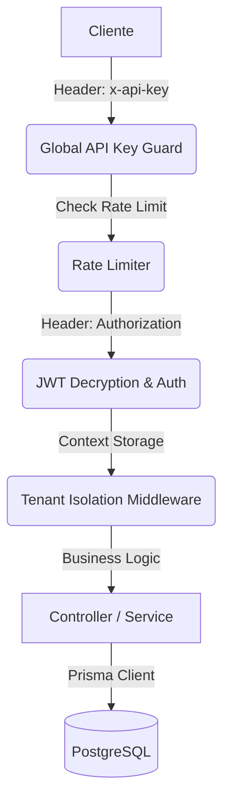

# 📖 Guía Técnica y Referencia de API - Exelixi Nexus

Esta documentación detalla el funcionamiento interno, los flujos de datos y la referencia completa de los endpoints del sistema **Exelixi Nexus**.

---

## 🏗️ Arquitectura y Flujo de Peticiones

### 1. El Viaje de una Petición



### 2. Aislamiento Multi-tenant

- **Garantía**: Todas las consultas vía Prisma incluyen automáticamente el filtro de `empresaId` extraído del token encriptado.

---

## 🔐 Seguridad y Autenticación

### Encriptación de Tokens (AES-256-CBC)

Los JWT no viajan en texto plano. Se cifran usando una llave de 32 bytes (`ENCRYPTION_KEY`). Esto evita que el contenido del token sea visible en herramientas de inspección si no se posee la llave.

---

## 📡 Referencia Completa de Endpoints

### 1. Módulo: Autenticación (`/api/auth`)

#### `POST /login`

- **Body**: `{ "email": "admin@acme.com", "password": "..." }`
- **Response Example**:
  ```json
  {
    "token": "a1b2c3d4... (Token Cifrado)",
    "user": {
      "id": 1,
      "nombre": "Admin Usuario",
      "email": "admin@acme.com",
      "empresaId": 1
    }
  }
  ```

#### `GET /me`

- **Response Example**:
  ```json
  {
    "id": 1,
    "nombre": "Admin Usuario",
    "email": "admin@acme.com",
    "empresaId": 1,
    "role": { "id": 5, "nombre": "Administrador" },
    "permissions": [
      { "moduloId": 1, "nombre": "Ventas", "canRead": true, "canCreate": true }
    ]
  }
  ```

---

### 2. Módulo: Empresas / Tenants (`/api/companies`)

#### `POST /`

- **Body**: `{ "nombre": "Empresa S.A", "rif": "J-123", "tipo": "CLIENTE" }`
- **Response Example**:
  ```json
  {
    "success": true,
    "message": "Empresa creada exitosamente",
    "data": {
      "id": 15,
      "nombre": "Empresa S.A",
      "rif": "J-123",
      "activo": true
    }
  }
  ```

#### `POST /toggle-module`

- **Body**: `{ "empresaId": 1, "moduloId": 5, "active": true }`
- **Response Example**:
  ```json
  {
    "success": true,
    "message": "Módulo activado exitosamente",
    "data": { "id": 45, "empresaId": 1, "moduloId": 5, "activo": true }
  }
  ```

---

### 3. Módulo: Usuarios (`/api/users`)

#### `POST /`

- **Body**: `{ "email": "qa@test.com", "nombre": "QA", "roleId": 10, "password": "..." }`
- **Response Example**:
  ```json
  {
    "id": 54,
    "nombre": "QA",
    "email": "qa@test.com",
    "roleId": 10
  }
  ```

#### `PATCH /:id/status`

- **Response Example**:
  ```json
  {
    "message": "Estado del usuario actualizado",
    "active": false
  }
  ```

---

### 4. Módulo: Roles y Permisos (`/api/roles`)

#### `GET /matrix/:roleId`

- **Response Example**:
  ```json
  [
    {
      "moduloId": 1,
      "nombre": "Ventas",
      "activo": true,
      "canCreate": true,
      "canRead": true,
      "submodulos": []
    }
  ]
  ```

#### `POST /permissions`

- **Body**: `{ "roleId": 5, "permissions": [...] }`
- **Response Example**:
  ```json
  { "success": true }
  ```

---

### 5. Módulo: Gestión de Módulos (`/api/modules`)

#### `GET /`

- **Response Example**:
  ```json
  {
    "success": true,
    "data": [{ "id": 1, "nombre": "Dashboard", "activo": true }]
  }
  ```

#### `POST /submodule`

- **Body**: `{ "moduloId": 1, "nombre": "Reportes PDF" }`
- **Response Example**:
  ```json
  {
    "success": true,
    "data": { "id": 22, "moduloId": 1, "nombre": "Reportes PDF" }
  }
  ```

---

## 📡 Observabilidad

### Headers de Respuesta

Cada respuesta incluye el header `x-request-id`.

```http
HTTP/1.1 200 OK
x-request-id: 550e8400-e29b-41d4-a716-446655440000
```

---

👉 _Para esquemas JSON detallados, consulte la documentación interactiva en `/api-docs`._
