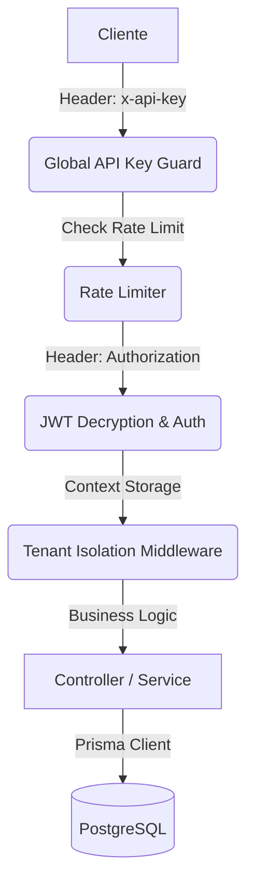

# 📖 Guía Técnica y Referencia de API - Exelixi Nexus

Esta documentación detalla el funcionamiento interno, los flujos de datos y la referencia completa de los endpoints del sistema **Exelixi Nexus**.

---

## 🏗️ Arquitectura y Flujo de Peticiones

El sistema opera bajo un modelo de **Defensa en Profundidad**. Cada petición HTTP atraviesa las siguientes capas antes de tocar la lógica de negocio:

### 1. El Viaje de una Petición



### 2. Aislamiento Multi-tenant

El sistema utiliza `AsyncLocalStorage` para inyectar el contexto de la empresa (`empresaId`) en el hilo de ejecución.

- **Garantía**: Ninguna consulta a la base de datos se realiza sin un filtro `where: { empresaId }`, lo que imposibilita fugas de información entre clientes del SaaS.

---

## 🔐 Seguridad y Autenticación

### Encriptación de Tokens

A diferencia de los sistemas estándar, Exelixi Nexus **cifra los JWT** antes de enviarlos.

- **Algoritmo**: AES-256-CBC.
- **Llave**: `ENCRYPTION_KEY` (32 bytes).
- **Proceso**:
  1. Generación de JWT estándar.
  2. Encriptación del string del JWT.
  3. Envío al cliente.
  4. El middleware de auth desencripta y valida en cada petición.

### Headers Requeridos

| Header          | Valor                           | Obligatorio                     |
| :-------------- | :------------------------------ | :------------------------------ |
| `x-api-key`     | Token global definido en `.env` | **SÍ** (En todos los endpoints) |
| `Authorization` | `Bearer <token_encriptado>`     | **SÍ** (En rutas protegidas)    |
| `Content-Type`  | `application/json`              | **SÍ**                          |

---

## 📡 Referencia Detallada de Endpoints

### 🔑 Módulo: Auth (`/api/auth`)

Gestiona el acceso y la identidad.

#### `POST /login`

Autentica al usuario y devuelve el token cifrado.

- **Body**: `{ "email": "...", "password": "..." }`
- **Response**: `{ "token": "...", "user": { "id": 1, "nombre": "...", "empresaId": 1 } }`

#### `GET /me`

Obtiene el perfil del usuario logueado y su **Matriz de Permisos**.

- **Response**: Incluye el objeto `permissions` con los módulos que el usuario puede CRUDear.

---

### 🧩 Módulo: Gestión de Módulos (`/api/modules`)

Controla las funcionalidades disponibles en el ecosistema SaaS.

#### `GET /`

Lista los módulos que la empresa del usuario tiene actualmente **contratados y activos**.

- **Flujo**: Se usa para renderizar el menú lateral en el frontend.

#### `POST /submodule`

Crea una sub-funcionalidad vinculada a un módulo padre.

- **Importante**: Permite granularidad extrema en los permisos (ej: Módulo "Ventas" -> Submódulo "Reportes").

---

### 👥 Módulo: Usuarios y Roles (`/api/users`, `/api/roles`)

Implementa el modelo **RBAC (Role-Based Access Control)**.

#### `POST /roles/permissions`

Define qué puede hacer un rol en cada módulo.

- **Payload**:
  ```json
  {
    "roleId": 10,
    "permissions": [
      {
        "moduloId": 1,
        "canRead": true,
        "canCreate": true,
        "canUpdate": false,
        "canDelete": false
      }
    ]
  }
  ```

#### `PATCH /users/:id/status`

Realiza un **Soft Delete**. El usuario no se borra de la DB para mantener integridad histórica, pero se le impide el acceso al sistema.

---

## 📡 Observabilidad y Debugging

### Correlación de Logs (`requestId`)

Cada petición recibe un `requestId` único (UUID). Este ID aparece en:

1. El header de respuesta `x-request-id`.
2. Los logs de consola y archivos.
3. Las alertas de **Sentry**.

**Uso**: Si un usuario reporta un error, pídele el `x-request-id` y búscalo en los logs para ver la traza exacta de lo que ocurrió.

---

## 🛠️ Desarrollo y QA

### Suite de Pruebas Integrales

Para validar que un cambio no rompió el flujo CRUD o la seguridad multi-tenant, ejecuta:

```bash
./qa_test.sh
```

El script realiza un ciclo de vida real:

1. Crea una Empresa.
2. Crea un Módulo.
3. Crea un Rol y le asigna permisos al Módulo.
4. Crea un Usuario con ese Rol.
5. Intenta violar la seguridad accediendo a otros datos.
6. Limpia los datos de prueba.

---

👉 _Para dudas adicionales, consulta la documentación Swagger en el endpoint `/api-docs`._
