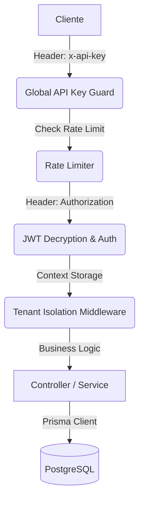

# 📖 Guía Técnica y Referencia de API - Exelixi Nexus

Esta documentación detalla el funcionamiento interno, los flujos de datos y la referencia completa de los endpoints del sistema **Exelixi Nexus**.

---

## 🏗️ Arquitectura y Flujo de Peticiones

### 1. El Viaje de una Petición



---

## 🔐 Seguridad y Autenticación

### Encriptación de Tokens (AES-256-CBC)

Los JWT no viajan en texto plano. Se cifran usando una llave de 32 bytes (`ENCRYPTION_KEY`). Esto evita que el contenido del token sea visible en herramientas de inspección si no se posee la llave.

---

## 📡 Referencia Detallada de Endpoints y Lógica de Negocio

### 1. Módulo: Autenticación (`/api/auth`)

#### `POST /login`

- **¿Qué hace?**: Autentica al usuario y genera el token cifrado.
- **Body (JSON)**:
  ```json
  {
    "email": "admin@acme.com",
    "password": "mi_password_seguro"
  }
  ```
- **Response Example**:
  ```json
  { "token": "...", "user": { "id": 1, "nombre": "Admin", "empresaId": 1 } }
  ```

#### `POST /change-password`

- **¿Qué hace?**: Permite al usuario cambiar su propia contraseña.
- **Body (JSON)**:
  ```json
  {
    "currentPassword": "password_actual",
    "newPassword": "nuevo_password_123"
  }
  ```

---

### 2. Módulo: Empresas / Tenants (`/api/companies`)

#### `POST /`

- **¿Qué hace?**: Registra una nueva empresa SaaS.
- **Body (JSON)**:
  ```json
  {
    "nombre": "Acme Corp",
    "rif": "J-31234567",
    "tipo": "CLIENTE"
  }
  ```

#### `POST /toggle-module`

- **¿Qué hace?**: Activa/Desactiva módulos para una empresa.
- **Body (JSON)**:
  ```json
  {
    "empresaId": 1,
    "moduloId": 5,
    "active": true
  }
  ```

---

### 3. Módulo: Usuarios (`/api/users`)

#### `POST /`

- **¿Qué hace?**: Crea un nuevo usuario en la empresa.
- **Body (JSON)**:
  ```json
  {
    "email": "nuevo@empresa.com",
    "nombre": "Juan Pérez",
    "roleId": 10,
    "password": "password_temporal"
  }
  ```

#### `PUT /:id`

- **Body (JSON)**:
  ```json
  {
    "nombre": "Juan Pérez Actualizado",
    "email": "juan.nuevo@empresa.com"
  }
  ```

---

### 4. Módulo: Roles y Permisos (`/api/roles`)

#### `POST /`

- **Body (JSON)**:
  ```json
  {
    "nombre": "Supervisor de Ventas"
  }
  ```

#### `POST /permissions`

- **¿Qué hace?**: Define capacidades CRUD.
- **Body (JSON)**:
  ```json
  {
    "roleId": 5,
    "permissions": [
      {
        "moduloId": 1,
        "canRead": true,
        "canCreate": true,
        "canUpdate": false,
        "canDelete": false
      }
    ]
  }
  ```

---

### 5. Módulo: Gestión de Módulos (`/api/modules`)

#### `POST /`

- **Body (JSON)**:
  ```json
  {
    "nombre": "Nuevo Módulo Core"
  }
  ```

#### `POST /submodule`

- **¿Qué hace?**: Crea una sub-funcionalidad.
- **Body (JSON)**:
  ```json
  {
    "moduloId": 1,
    "nombre": "Reportes Mensuales"
  }
  ```

---

## 📡 Observabilidad y Diagnóstico

### Trazabilidad con `requestId`

Cada petición HTTP es marcada con un UUID único en el header `x-request-id`.

---

👉 _Para esquemas JSON detallados, consulte la documentación interactiva en `/api-docs`._
