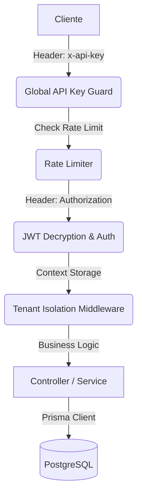

# 📖 Guía Técnica y Referencia de API - Exelixi Nexus

Esta documentación detalla el funcionamiento interno, los flujos de datos y la referencia completa de los endpoints del sistema **Exelixi Nexus**.

---

## 🏗️ Arquitectura y Flujo de Peticiones

El sistema opera bajo un modelo de **Defensa en Profundidad**. Cada petición HTTP atraviesa las siguientes capas antes de tocar la lógica de negocio:

### 1. El Viaje de una Petición



### 2. Aislamiento Multi-tenant

El sistema utiliza `AsyncLocalStorage` para inyectar el contexto de la empresa (`empresaId`) en el hilo de ejecución.

- **Garantía**: Todas las consultas vía Prisma incluyen automáticamente el filtro de `empresaId` extraído del token encriptado.

---

## 🔐 Seguridad y Autenticación

### Encriptación de Tokens (AES-256-CBC)

Los JWT no viajan en texto plano. Se cifran usando una llave de 32 bytes (`ENCRYPTION_KEY`). Esto evita que el contenido del token sea visible en herramientas de inspección si no se posee la llave.

### Headers Globales Requeridos

| Header          | Valor                                     |
| :-------------- | :---------------------------------------- |
| `x-api-key`     | Token de infraestructura (fijo en `.env`) |
| `Authorization` | `Bearer <token_encriptado>`               |

---

## 📡 Referencia Completa de Endpoints

### 1. Módulo: Autenticación (`/api/auth`)

#### `POST /login`

- **Descripción**: Valida credenciales y genera el token de sesión cifrado.
- **Body**: `{ "email": "admin@acme.com", "password": "..." }`
- **Éxito (200)**: Devuelve el token y datos básicos del usuario.

#### `GET /me`

- **Descripción**: Devuelve la identidad del usuario actual y su matriz de permisos.
- **Headers**: Requiere Bearer Token.

#### `POST /change-password`

- **Descripción**: Permite al usuario cambiar su propia contraseña.
- **Body**: `{ "currentPassword": "...", "newPassword": "..." }`

---

### 2. Módulo: Empresas / Tenants (`/api/companies`)

#### `GET /`

- **Descripción**: Lista todas las empresas (Uso para SaaS Admin).

#### `POST /`

- **Descripción**: Registra una nueva empresa en el ecosistema.
- **Body**: `{ "nombre": "Empresa S.A", "rif": "J-123", "tipo": "CLIENTE" }`

#### `GET /:id` | `PUT /:id` | `DELETE /:id`

- **Descripción**: CRUD estándar de una empresa por su ID numérico.

#### `POST /toggle-module`

- **Descripción**: Vincula o desvincula un módulo global a una empresa específica.
- **Body**: `{ "empresaId": 1, "moduloId": 5, "active": true }`

---

### 3. Módulo: Usuarios (`/api/users`)

#### `GET /`

- **Descripción**: Lista los usuarios pertenecientes a la empresa del administrador que consulta.

#### `POST /`

- **Descripción**: Crea un nuevo usuario y lo vincula a un Rol.
- **Body**: `{ "email": "...", "nombre": "...", "roleId": 10, "password": "..." }`

#### `PUT /:id`

- **Descripción**: Actualiza datos de perfil del usuario.

#### `PATCH /:id/status`

- **Descripción**: Cambia el estado `activo` (true/false) del usuario.

---

### 4. Módulo: Roles y Permisos (`/api/roles`)

#### `GET /` | `POST /`

- **Descripción**: Gestión de los perfiles de acceso de la empresa.

#### `PUT /:id` | `DELETE /:id`

- **Descripción**: Edición y borrado (protegido si el rol tiene usuarios).

#### `GET /matrix/:roleId`

- **Descripción**: Obtiene la matriz cruzada de Módulos Activos vs Permisos del Rol.

#### `POST /permissions`

- **Descripción**: Asigna permisos granulares CRUD a un rol.
- **Body**:
  ```json
  {
    "roleId": 5,
    "permissions": [
      {
        "moduloId": 1,
        "canRead": true,
        "canCreate": true,
        "canUpdate": false,
        "canDelete": false
      }
    ]
  }
  ```

---

### 5. Módulo: Gestión de Módulos (`/api/modules`)

#### `GET /`

- **Descripción**: Lista módulos activos para la empresa actual.

#### `GET /all`

- **Descripción**: Lista todos los módulos y sus submódulos (Global Admin).

#### `POST /` | `PUT /:id` | `DELETE /:id`

- **Descripción**: CRUD de definiciones de módulos globales.

#### `POST /submodule`

- **Descripción**: Crea una funcionalidad hija dentro de un módulo.
- **Body**: `{ "moduloId": 1, "nombre": "Reportes PDF" }`

#### `PUT /submodule/:id` | `DELETE /submodule/:id`

- **Descripción**: Gestión de submódulos existentes.

---

## 🛠️ Testing e Integración Continua

Para asegurar que ningún cambio rompa estos flujos, el sistema cuenta con una **Suite de QA** integral:

```bash
./qa_test.sh
```

Este script simula el 100% de los endpoints anteriores en una base de datos de prueba.

---

👉 _Para esquemas JSON detallados, consulte la documentación interactiva en `/api-docs`._
