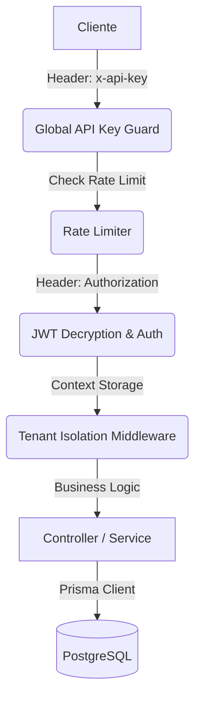

# 📖 Guía Técnica y Referencia de API - Exelixi Nexus

Esta documentación detalla el funcionamiento interno, los flujos de datos y la referencia completa de los endpoints del sistema **Exelixi Nexus**.

---

## 🏗️ Arquitectura y Flujo de Peticiones

### 1. El Viaje de una Petición



---

## 🔐 Seguridad y Autenticación

### Encriptación de Tokens (AES-256-CBC)

Los JWT no viajan en texto plano. Se cifran usando una llave de 32 bytes (`ENCRYPTION_KEY`). Esto evita que el contenido del token sea visible en herramientas de inspección si no se posee la llave.

---

## 📡 Referencia Detallada de Endpoints y Lógica de Negocio

### 1. Módulo: Autenticación (`/api/auth`)

#### `POST /login`

- **¿Qué hace?**: Autentica al usuario, valida que la empresa esté activa y genera un token de sesión.
- **Lógica**: La contraseña se verifica mediante `bcrypt`. El token resultante se encripta simétricamente.
- **Response Example**:
  ```json
  {
    "token": "a1b2c3d4... (Token Cifrado)",
    "user": {
      "id": 1,
      "nombre": "Admin Usuario",
      "email": "admin@acme.com",
      "empresaId": 1
    }
  }
  ```

#### `GET /me`

- **¿Qué hace?**: Recupera el estado actual de la sesión del usuario.
- **Lógica**: Devuelve el perfil y la **Matriz de Permisos** actualizada para el frontend.
- **Response Example**:
  ```json
  {
    "id": 1,
    "nombre": "Admin Usuario",
    "email": "admin@acme.com",
    "empresaId": 1,
    "role": { "id": 5, "nombre": "Administrador" },
    "permissions": [
      { "moduloId": 1, "nombre": "Ventas", "canRead": true, "canCreate": true }
    ]
  }
  ```

---

### 2. Módulo: Empresas / Tenants (`/api/companies`)

#### `POST /`

- **¿Qué hace?**: Registra un nuevo cliente (Empresa) en el sistema SaaS.
- **Lógica**: Inicializa la estructura base de la empresa en estado `activo`.
- **Response Example**:
  ```json
  {
    "success": true,
    "message": "Empresa creada exitosamente",
    "data": {
      "id": 15,
      "nombre": "Empresa S.A",
      "rif": "J-123",
      "activo": true
    }
  }
  ```

#### `POST /toggle-module`

- **¿Qué hace?**: Activa/Desactiva funcionalidades para una empresa específica.
- **Lógica**: Si se desactiva, ningún usuario de esa empresa podrá acceder a dicha funcionalidad.
- **Response Example**:
  ```json
  {
    "success": true,
    "message": "Módulo activado exitosamente",
    "data": { "id": 45, "empresaId": 1, "moduloId": 5, "activo": true }
  }
  ```

---

### 3. Módulo: Usuarios (`/api/users`)

#### `POST /`

- **¿Qué hace?**: Crea un nuevo colaborador dentro de una empresa.
- **Lógica**: Vincula el usuario a un `roleId` y hashea la contraseña automáticamente.
- **Response Example**:
  ```json
  {
    "id": 54,
    "nombre": "QA User",
    "email": "qa@test.com",
    "roleId": 10
  }
  ```

#### `PATCH /:id/status`

- **¿Qué hace?**: Activa o desactiva a un usuario (**Soft Delete**).
- **Lógica**: Mantiene la integridad histórica sin borrar el registro físico.
- **Response Example**:
  ```json
  {
    "message": "Estado del usuario actualizado",
    "active": false
  }
  ```

---

### 4. Módulo: Roles y Permisos (`/api/roles`)

#### `GET /matrix/:roleId`

- **¿Qué hace?**: Genera un mapa completo de permisos para un rol.
- **Lógica**: Cruza módulos activos de la empresa con permisos granulares del rol.
- **Response Example**:
  ```json
  [
    {
      "moduloId": 1,
      "nombre": "Ventas",
      "activo": true,
      "canCreate": true,
      "canRead": true,
      "submodulos": []
    }
  ]
  ```

#### `POST /permissions`

- **¿Qué hace?**: Define las capacidades CRUD del rol.
- **Lógica**: Usa una transacción atómica para garantizar consistencia total.
- **Response Example**:
  ```json
  { "success": true }
  ```

---

### 5. Módulo: Gestión de Módulos (`/api/modules`)

#### `GET /`

- **¿Qué hace?**: Lista los módulos activos para la empresa, incluyendo sus submódulos.
- **Lógica**: Devuelve la estructura jerárquica necesaria para construir el menú de navegación. Los submódulos vienen anidados en el array `submodulos`.
- **Response Example**:
  ```json
  {
    "success": true,
    "data": [
      {
        "id": 1,
        "nombre": "Configuración",
        "activo": true,
        "submodulos": [
          { "id": 10, "nombre": "Perfiles" },
          { "id": 11, "nombre": "Empresas" }
        ]
      }
    ]
  }
  ```

#### `POST /submodule`

- **¿Qué hace?**: Añade granularidad (sub-funcionalidades) a un módulo principal.
- **Lógica**: Permite aislar permisos de secciones específicas dentro de un módulo padre.
- **Response Example**:
  ```json
  {
    "success": true,
    "data": { "id": 22, "moduloId": 1, "nombre": "Reportes PDF" }
  }
  ```

#### `PUT /submodule/:id`

- **¿Qué hace?**: Modifica el nombre o vinculación de un submódulo existente.
- **Response Example**:
  ```json
  { "success": true, "data": { "id": 22, "nombre": "Reportes Excel" } }
  ```

#### `DELETE /submodule/:id`

- **¿Qué hace?**: Elimina permanentemente una sub-funcionalidad.
- **Lógica**: Al eliminarlo, se borran automáticamente las relaciones en la matriz de permisos de todos los roles que lo tenían asignado.
- **Response Example**:
  ```json
  { "success": true, "message": "Submódulo eliminado" }
  ```

---

## 📡 Observabilidad y Diagnóstico

### Trazabilidad con `requestId`

Cada petición HTTP es marcada con un UUID único disponible en el header `x-request-id`.
**Uso**: Permite correlacionar errores en Sentry con logs específicos en el servidor.

---

👉 _Para esquemas JSON detallados, consulte la documentación interactiva en `/api-docs`._
