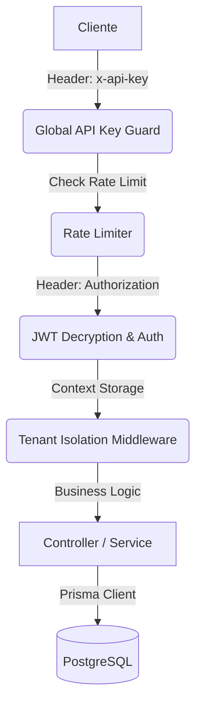

# 📖 Guía Técnica y Referencia de API - Exelixi Nexus

Esta documentación detalla el funcionamiento interno, los flujos de datos y la referencia completa de los endpoints del sistema **Exelixi Nexus**.

---

## 🏗️ Arquitectura y Flujo de Peticiones

### 1. El Viaje de una Petición



### 2. Aislamiento Multi-tenant

- **Lógica**: Utilizamos `AsyncLocalStorage` para inyectar el `empresaId` en el contexto de la petición. Prisma añade automáticamente este filtro en cada query, garantizando que un cliente nunca vea datos de otro.

---

## 🔐 Seguridad y Autenticación

### Encriptación de Tokens (AES-256-CBC)

- **¿Por qué?**: Los JWT estándar pueden ser decodificados por cualquiera (base64). Nosotros aplicamos una capa de cifrado simétrico para que el payload sea ilegible sin la `ENCRYPTION_KEY`.

---

## 📡 Referencia Detallada de Endpoints

### 1. Módulo: Autenticación (`/api/auth`)

#### `POST /login`

- **¿Qué hace?**: Valida credenciales y genera el token cifrado.
- **Lógica**: Las contraseñas se comparan usando `bcrypt`. Si la empresa está inactiva, se deniega el acceso.
- **Body**: `{ "email": "...", "password": "..." }`
- **Response Example**:
  ```json
  { "token": "...", "user": { "id": 1, "nombre": "Admin", "empresaId": 1 } }
  ```

#### `GET /me`

- **¿Qué hace?**: Devuelve la identidad y matriz de permisos del usuario actual.
- **Lógica**: Vital para que el frontend habilite/deshabilite opciones de UI según el rol.
- **Response Example**:
  ```json
  {
    "id": 1,
    "nombre": "Admin",
    "permissions": [{ "moduloId": 1, "nombre": "Ventas", "canRead": true }]
  }
  ```

#### `POST /change-password`

- **¿Qué hace?**: Actualización segura de contraseña.
- **Body**: `{ "currentPassword": "...", "newPassword": "..." }`
- **Response Example**:
  ```json
  { "success": true, "message": "Contraseña actualizada" }
  ```

---

### 2. Módulo: Empresas / Tenants (`/api/companies`)

#### `POST /`

- **¿Qué hace?**: Crea una nueva empresa cliente.
- **Lógica**: Inicializa la configuración básica del tenant en el ecosistema SaaS.
- **Body**: `{ "nombre": "...", "rif": "...", "tipo": "CLIENTE" }`
- **Response Example**:
  ```json
  { "success": true, "data": { "id": 10, "nombre": "Acme" } }
  ```

#### `POST /toggle-module`

- **¿Qué hace?**: Activa/Desactiva módulos para una empresa específica.
- **Lógica**: Es el interruptor maestro de funcionalidades por cliente.
- **Body**: `{ "empresaId": 1, "moduloId": 5, "active": true }`
- **Response Example**:
  ```json
  { "success": true, "data": { "empresaId": 1, "moduloId": 5, "activo": true } }
  ```

---

### 3. Módulo: Usuarios (`/api/users`)

#### `POST /`

- **¿Qué hace?**: Crea un usuario vinculado a un rol y empresa.
- **Lógica**: El sistema valida que el `roleId` pertenezca a la misma empresa del creador.
- **Body**: `{ "email": "...", "nombre": "...", "roleId": 10, "password": "..." }`
- **Response Example**:
  ```json
  { "id": 50, "nombre": "Juan", "email": "juan@test.com" }
  ```

#### `PATCH /:id/status`

- **¿Qué hace?**: Activación/Desactivación (**Soft Delete**).
- **Lógica**: No borramos registros para mantener trazabilidad histórica y auditoría.
- **Response Example**:
  ```json
  {
    "success": true,
    "message": "Estado actualizado",
    "data": { "activo": false }
  }
  ```

---

### 4. Módulo: Roles y Permisos (`/api/roles`)

#### `GET /matrix/:roleId`

- **¿Qué hace?**: Genera el mapa de permisos (Módulos vs CRUD).
- **Lógica**: Cruza módulos contratados por la empresa con permisos del rol.
- **Response Example**:
  ```json
  [{ "moduloId": 1, "nombre": "Ventas", "canRead": true, "submodulos": [] }]
  ```

#### `POST /permissions`

- **¿Qué hace?**: Asignación atómica de permisos.
- **Lógica**: Usa una **transacción Prisma** para asegurar que el rol nunca quede sin permisos si la operación falla a mitad de camino.
- **Body**: `{ "roleId": 5, "permissions": [...] }`
- **Response Example**:
  ```json
  { "success": true, "message": "Matriz actualizada" }
  ```

---

### 5. Módulo: Gestión de Módulos (`/api/modules`)

#### `GET /`

- **¿Qué hace?**: Lista módulos con sus submódulos anidados.
- **Lógica**: Facilita la construcción de menús jerárquicos en una sola petición.
- **Response Example**:
  ```json
  [
    {
      "id": 1,
      "nombre": "Ventas",
      "submodulos": [{ "id": 10, "nombre": "Facturas" }]
    }
  ]
  ```

#### `POST /submodule`

- **¿Qué hace?**: Crea una funcionalidad hija.
- **Body**: `{ "moduloId": 1, "nombre": "Sub-A" }`
- **Response Example**:
  ```json
  { "success": true, "data": { "id": 20, "nombre": "Sub-A" } }
  ```

---

## 📡 Observabilidad

### Correlación `x-request-id`

Todas las respuestas incluyen el header `x-request-id`. Este ID permite rastrear una petición fallida desde el frontend hasta los logs de Sentry y Winston.

---

👉 _Consulte `/api-docs` para esquemas JSON técnicos completos._
