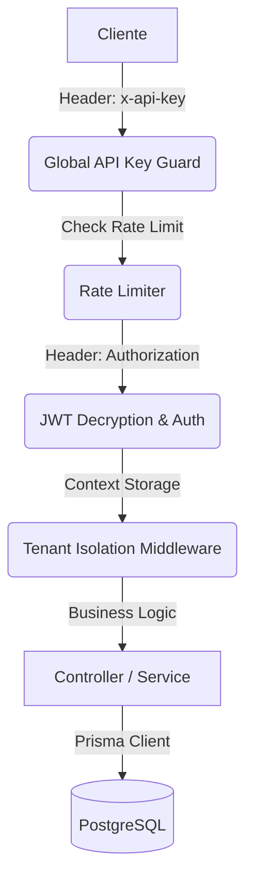

# 📖 Guía Técnica y Referencia de API - Exelixi Nexus

Esta documentación detalla el funcionamiento interno, los flujos de datos y la referencia completa de los endpoints del sistema **Exelixi Nexus**.

---

## 🏗️ Arquitectura y Flujo de Peticiones

### 1. El Viaje de una Petición



### 2. Aislamiento Multi-tenant

- **Garantía**: Todas las consultas vía Prisma incluyen automáticamente el filtro de `empresaId` extraído del token encriptado. Ningún usuario puede ver datos de otra empresa.

---

## 🔐 Seguridad y Autenticación

### Encriptación de Tokens (AES-256-CBC)

Los JWT no viajan en texto plano. Se cifran usando una llave de 32 bytes (`ENCRYPTION_KEY`). Esto evita que el contenido del token sea visible en herramientas de inspección si no se posee la llave.

---

## 📡 Referencia Detallada de Endpoints y Lógica de Negocio

### 1. Módulo: Autenticación (`/api/auth`)

#### `POST /login`

- **¿Qué hace?**: Valida credenciales y genera el token cifrado.
- **Body (JSON)**: `{ "email": "admin@acme.com", "password": "..." }`
- **Response Example**:
  ```json
  {
    "token": "c1f2r3a4... (JWT Cifrado)",
    "user": { "id": 1, "nombre": "Admin", "empresaId": 1 }
  }
  ```

#### `GET /me`

- **¿Qué hace?**: Devuelve la identidad y matriz de permisos del usuario actual.
- **Lógica**: Vital para que el frontend habilite/deshabilite opciones de UI.

#### `POST /change-password`

- **¿Qué hace?**: Actualización segura de contraseña por el propio usuario.
- **Body (JSON)**: `{ "currentPassword": "...", "newPassword": "..." }`
- **Response Example**:
  ```json
  { "success": true, "message": "Contraseña actualizada exitosamente" }
  ```

---

### 2. Módulo: Empresas / Tenants (`/api/companies`)

#### `GET /`

- **¿Qué hace?**: Listado global de empresas (SaaS Admin).

#### `POST /`

- **¿Qué hace?**: Crea una nueva empresa cliente.
- **Body (JSON)**: `{ "nombre": "...", "rif": "...", "tipo": "CLIENTE" }`

#### `GET /:id` | `PUT /:id`

- **¿Qué hace?**: Consulta y edición de datos fiscales de la empresa.

#### `DELETE /:id`

- **¿Qué hace?**: Desactivación lógica de la empresa.

#### `POST /toggle-module`

- **¿Qué hace?**: Activa/Desactiva módulos globales para una empresa específica.
- **Body (JSON)**: `{ "empresaId": 1, "moduloId": 5, "active": true }`
- **Response Example**:
  ```json
  {
    "success": true,
    "data": { "empresaId": 1, "moduloId": 5, "activo": true }
  }
  ```

---

### 3. Módulo: Usuarios (`/api/users`)

#### `GET /`

- **¿Qué hace?**: Lista los usuarios de la empresa actual del administrador.

#### `POST /`

- **¿Qué hace?**: Crea un usuario vinculado a un rol y empresa.
- **Body (JSON)**: `{ "email": "...", "nombre": "...", "roleId": 10, "password": "..." }`

#### `PUT /:id`

- **¿Qué hace?**: Actualiza perfil de usuario.

#### `PATCH /:id/status`

- **¿Qué hace?**: Activación/Desactivación (Soft Delete).
- **Response Example**:
  ```json
  {
    "success": true,
    "message": "Estado del usuario actualizado",
    "data": { "id": 5, "activo": false }
  }
  ```

---

### 4. Módulo: Roles y Permisos (`/api/roles`)

#### `GET /` | `POST /`

- **¿Qué hace?**: Gestión de roles de la empresa.
- **Body (POST)**: `{ "nombre": "Nombre del Rol" }`

#### `PUT /:id` | `DELETE /:id`

- **¿Qué hace?**: Edición y borrado (protegido si el rol tiene usuarios asignados).

#### `GET /matrix/:roleId`

- **¿Qué hace?**: Devuelve la matriz completa de Módulos Activos vs Permisos.
- **Response Example**:
  ```json
  [
    {
      "moduloId": 1,
      "nombre": "Ventas",
      "canRead": true,
      "canCreate": false,
      "submodulos": []
    }
  ]
  ```

#### `POST /permissions`

- **¿Qué hace?**: Asignación atómica de permisos CRUD.
- **Body (JSON)**: `{ "roleId": 5, "permissions": [ { "moduloId": 1, "canRead": true, ... } ] }`
- **Response Example**:
  ```json
  { "success": true, "message": "Matriz de permisos actualizada" }
  ```

---

### 5. Módulo: Gestión de Módulos (`/api/modules`)

#### `GET /` | `GET /all`

- **¿Qué hace?**: `/` lista activos para la empresa. `/all` lista el catálogo global.
- **Lógica**: Los módulos incluyen sus `submodulos` anidados en la respuesta.

#### `POST /` | `PUT /:id` | `DELETE /:id`

- **¿Qué hace?**: Gestión del catálogo maestro de funcionalidades (Admin).

#### `POST /submodule`

- **¿Qué hace?**: Crea una funcionalidad hija vinculada a un módulo.
- **Body (JSON)**: `{ "moduloId": 1, "nombre": "Nombre Submódulo" }`
- **Response Example**:
  ```json
  {
    "success": true,
    "data": { "id": 105, "nombre": "Nuevo Submódulo", "moduloId": 1 }
  }
  ```

#### `PUT /submodule/:id` | `DELETE /submodule/:id`

- **¿Qué hace?**: Edición y borrado de submódulos.

---

## 📡 Observabilidad

### Correlación `x-request-id`

Todas las respuestas incluyen el header `x-request-id` para trazabilidad en Sentry y Logs.

---

👉 _Consulte `/api-docs` para especificaciones técnicas adicionales._
