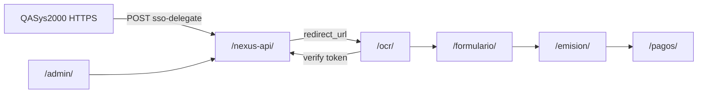

# cierrelmds.exelixitech.com — Mapa HTTPS con prefijos

Dominio único para QASys2000 + módulos Exelixi en **srv001** (`192.168.8.120`).  
**Todos los servicios públicos usan prefijo** (incluido OCR en `/ocr/`, no en la raíz).

**SysIP-backend (`:3002`)** — solo interno, sin prefijo público.

---

## 1. URLs públicas (documentación / integración)

| Prefijo        | URL HTTPS                                      | Puerto PM2 | Servicio       |
| -------------- | ---------------------------------------------- | ---------- | -------------- |
| `/ocr/`        | https://cierrelmds.exelixitech.com/ocr/        | 5181       | OCR web        |
| `/formulario/` | https://cierrelmds.exelixitech.com/formulario/ | 5182       | Formulario web |
| `/emision/`    | https://cierrelmds.exelixitech.com/emision/    | 5183       | Emisión web    |
| `/pagos/`      | https://cierrelmds.exelixitech.com/pagos/      | 5184       | Pagos web      |
| `/nexus-api/`  | https://cierrelmds.exelixitech.com/nexus-api/  | 3092       | Nexus API      |
| `/admin/`      | https://cierrelmds.exelixitech.com/admin/      | 5200       | Nexus Admin    |

Redirección recomendada: `/` → `/ocr/` (301).

---

## 2. Endpoints API y documentación Swagger

| Recurso                  | URL HTTPS                                                          |
| ------------------------ | ------------------------------------------------------------------ |
| Health check             | https://cierrelmds.exelixitech.com/nexus-api/health                |
| SSO delegate (QASys2000) | https://cierrelmds.exelixitech.com/nexus-api/api/auth/sso-delegate |
| Swagger Nexus API        | https://cierrelmds.exelixitech.com/nexus-api/api-docs              |

Las APIs de módulos (`:4001`–`:4004`, Swagger en `/docs`) **no se publican por HTTPS**.  
Los frontends las consumen vía proxy interno (`{prefijo}api` → `127.0.0.1:400x`).

---

## 3. Apache (infra) — ProxyPass

Usar **un solo** VirtualHost SSL: `cierrelmds.exelixitech.com-le-ssl.conf` (Certbot).

```apache
# Frontends: SIN strip del prefijo (Vite base=/ocr/, etc.)
ProxyPass        /ocr/         http://127.0.0.1:5181/ocr/
ProxyPassReverse /ocr/         http://127.0.0.1:5181/ocr/

ProxyPass        /formulario/  http://127.0.0.1:5182/formulario/
ProxyPassReverse /formulario/  http://127.0.0.1:5182/formulario/

ProxyPass        /emision/     http://127.0.0.1:5183/emision/
ProxyPassReverse /emision/     http://127.0.0.1:5183/emision/

ProxyPass        /pagos/       http://127.0.0.1:5184/pagos/
ProxyPassReverse /pagos/       http://127.0.0.1:5184/pagos/

ProxyPass        /admin/       http://127.0.0.1:5200/admin/
ProxyPassReverse /admin/       http://127.0.0.1:5200/admin/

# Nexus API: CON strip del prefijo hacia el backend
ProxyPass        /nexus-api/   http://127.0.0.1:3092/
ProxyPassReverse /nexus-api/   http://127.0.0.1:3092/

RedirectMatch ^/$ /ocr/
```

Verificación:

```bash
curl -s https://cierrelmds.exelixitech.com/nexus-api/health
# → JSON {"status":"ok",...}  (NO HTML de OCR)

curl -sI https://cierrelmds.exelixitech.com/ocr/ | head -3
curl -sI https://cierrelmds.exelixitech.com/admin/ | head -3
```

---

## 4. Deploy aplicaciones (dev / srv001)

Script: `scripts/deploy-cierrelmds-prefixes-srv001.sh`

Variables de build por servicio:

```bash
export VITE_NEXUS_API_URL=https://cierrelmds.exelixitech.com/nexus-api

# Módulos (ocr, formulario, emision, pagos)
export VITE_APP_BASE=/ocr/          # o /formulario/, /emision/, /pagos/
cd frontend && npm run build && pm2 restart ocr-web

# Nexus Admin
export VITE_APP_BASE=/admin/
export VITE_API_URL=$VITE_NEXUS_API_URL
cd ~/nexus-admin && npm run build && pm2 restart nexus-admin
```

---

## 5. Base de datos — URLs de submódulos (flujo SSO / flow)

```sql
UPDATE submodulo SET submodulo_url = 'https://cierrelmds.exelixitech.com/ocr/'        WHERE submodulo_nombre ILIKE 'OCR Documentos%';
UPDATE submodulo SET submodulo_url = 'https://cierrelmds.exelixitech.com/formulario/' WHERE submodulo_nombre ILIKE 'Formulario%';
UPDATE submodulo SET submodulo_url = 'https://cierrelmds.exelixitech.com/emision/'   WHERE submodulo_nombre ILIKE 'Emisión%' OR submodulo_nombre ILIKE 'Emision%';
UPDATE submodulo SET submodulo_url = 'https://cierrelmds.exelixitech.com/pagos/'      WHERE submodulo_nombre ILIKE 'Pagos%';
```

---

## 6. QASys2000 (Angular HTTPS)

```typescript
// SSO — POST con header x-api-key
'https://cierrelmds.exelixitech.com/nexus-api/api/auth/sso-delegate';

// Respuesta redirect_url apunta a:
// https://cierrelmds.exelixitech.com/ocr/?nexus_token=...
```

Origen permitido en CORS: `https://qasys2000.lamundialdeseguros.com` (ya configurado).

---

## 7. Flujo resumido



---

## 8. Estado del código (repositorios)

| Repo                   | Prefijo Vite        | Remote srv001    |
| ---------------------- | ------------------- | ---------------- |
| ocr-documentos-modulo  | `/ocr/`             | jsotoexelixitech |
| Formulario-modulo      | `/formulario/`      | jsotoexelixitech |
| Emision-Plan-modulo    | `/emision/`         | jsotoexelixitech |
| Pagos-Poliza-modulo    | `/pagos/`           | jsotoexelixitech |
| exelixi-nexus (admin)  | `/admin/`           | jsotoexelixitech |
| exelixi-nexus-services | proxy `/nexus-api/` | jsotoexelixitech |

**Pendiente infra:** aplicar ProxyPass en Apache (especialmente `/nexus-api/`).  
**Pendiente deploy:** `nexus-admin` rebuild con `VITE_APP_BASE=/admin/` en srv001.
