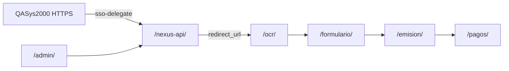

# cierrelmds.exelixitech.com — Mapa HTTPS (producción activa)

Dominio único **La Mundial / Exélixi** en **srv001** (`192.168.8.120`).  
Apache en **HTTPS :443** publica cada servicio con **prefijo** (`/admin/`, `/ocr/`, …).

**Verificado** (curl 2026-07-07): todos los prefijos responden `HTTP 200`.

**nest-api (`:3002`)** — prefijo público **`/nest-api-docs/`** (Apache strip → `:3002`).

---

## 1. URLs públicas recomendadas (HTTPS :443)

| Prefijo           | URL HTTPS                                         | Puerto PM2 | PM2              |
| ----------------- | ------------------------------------------------- | ---------- | ---------------- |
| `/nest-api-docs/` | https://cierrelmds.exelixitech.com/nest-api-docs/ | 3002       | `sysip-nest-api` |
| `/admin/`         | https://cierrelmds.exelixitech.com/admin/         | 5200       | `nexus-admin`    |
| `/ocr/`           | https://cierrelmds.exelixitech.com/ocr/           | 5181       | `ocr-web`        |
| `/formulario/`    | https://cierrelmds.exelixitech.com/formulario/    | 5182       | `form-web`       |
| `/emision/`       | https://cierrelmds.exelixitech.com/emision/       | 5183       | `emision-web`    |
| `/pagos/`         | https://cierrelmds.exelixitech.com/pagos/         | 5184       | `pagos-web`      |
| `/nexus-api/`     | https://cierrelmds.exelixitech.com/nexus-api/     | 3092       | `nexus-api`      |

Las APIs de módulos (`:4001`–`:4004`) **no se publican por HTTPS externo**.  
Los frontends las consumen vía proxy interno (`{prefijo}api` → `127.0.0.1:400x` o `vite preview`).

---

## 2. Acceso alternativo por puerto (interno / firewall)

Si el puerto está abierto, también funciona acceso directo al PM2:

| Servicio | URL alternativa                          |
| -------- | ---------------------------------------- |
| Admin    | https://cierrelmds.exelixitech.com:5200/ |
| OCR      | https://cierrelmds.exelixitech.com:5181/ |
| …        | `:5182`, `:5183`, `:5184`, `:3092`       |

Desde internet, lo habitual es **:443 con prefijo**. Los puertos altos pueden estar cerrados en el firewall.

---

## 3. Endpoints API y Swagger

| Recurso                  | URL HTTPS                                                          |
| ------------------------ | ------------------------------------------------------------------ |
| Health check             | https://cierrelmds.exelixitech.com/nexus-api/health                |
| SSO delegate (QASys2000) | https://cierrelmds.exelixitech.com/nexus-api/api/auth/sso-delegate |
| Swagger Nexus API        | https://cierrelmds.exelixitech.com/nexus-api/api-docs              |
| Swagger nest-api         | https://cierrelmds.exelixitech.com/nest-api-docs/docs              |

---

## 4. Apache (infra) — ProxyPass

VirtualHost SSL: `cierrelmds.exelixitech.com` (Certbot).

```apache
# Frontends: SIN strip del prefijo (Vite base=/ocr/, etc.)
ProxyPass        /ocr/         http://127.0.0.1:5181/ocr/
ProxyPassReverse /ocr/         http://127.0.0.1:5181/ocr/

ProxyPass        /formulario/  http://127.0.0.1:5182/formulario/
ProxyPassReverse /formulario/  http://127.0.0.1:5182/formulario/

ProxyPass        /emision/     http://127.0.0.1:5183/emision/
ProxyPassReverse /emision/     http://127.0.0.1:5183/emision/

ProxyPass        /pagos/       http://127.0.0.1:5184/pagos/
ProxyPassReverse /pagos/       http://127.0.0.1:5184/pagos/

ProxyPass        /admin/       http://127.0.0.1:5200/admin/
ProxyPassReverse /admin/       http://127.0.0.1:5200/admin/

# Nexus API: CON strip del prefijo hacia el backend
ProxyPass        /nexus-api/   http://127.0.0.1:3092/
ProxyPassReverse /nexus-api/   http://127.0.0.1:3092/

# nest-api (La Mundial RCV / personas): CON strip del prefijo
ProxyPass        /nest-api-docs/   http://127.0.0.1:3002/
ProxyPassReverse /nest-api-docs/   http://127.0.0.1:3002/
```

---

## 5. Build en srv001

Script: `scripts/deploy-cierrelmds-srv001.sh`

```bash
export VITE_NEXUS_API_URL=https://cierrelmds.exelixitech.com/nexus-api

# Módulos
export VITE_APP_BASE=/ocr/          # o /formulario/, /emision/, /pagos/

# Nexus Admin
export VITE_APP_BASE=/admin/
export VITE_API_URL=$VITE_NEXUS_API_URL
```

| Repo            | `VITE_APP_BASE` |
| --------------- | --------------- |
| `~/nexus-admin` | `/admin/`       |
| OCR             | `/ocr/`         |
| Formulario      | `/formulario/`  |
| Emisión         | `/emision/`     |
| Pagos           | `/pagos/`       |

---

## 6. Base de datos — URLs de submódulos (flujo SSO / bridge)

```sql
UPDATE submodulo SET submodulo_url = 'https://cierrelmds.exelixitech.com/ocr/'        WHERE submodulo_nombre ILIKE 'OCR Documentos%';
UPDATE submodulo SET submodulo_url = 'https://cierrelmds.exelixitech.com/formulario/' WHERE submodulo_nombre ILIKE 'Formulario%';
UPDATE submodulo SET submodulo_url = 'https://cierrelmds.exelixitech.com/emision/'   WHERE submodulo_nombre ILIKE 'Emisión%' OR submodulo_nombre ILIKE 'Emision%';
UPDATE submodulo SET submodulo_url = 'https://cierrelmds.exelixitech.com/pagos/'      WHERE submodulo_nombre ILIKE 'Pagos%';
```

El SSO también resuelve por **nombre** si la URL no lleva puerto (`auth.controller.ts`).

---

## 7. QASys2000 (Angular HTTPS)

```typescript
'https://cierrelmds.exelixitech.com/nexus-api/api/auth/sso-delegate';

// redirect_url → https://cierrelmds.exelixitech.com/ocr/?nexus_token=...
```

CORS: origen `https://cierrelmds.exelixitech.com` (puerto 443 implícito) + puertos directos si aplica.

---

## 8. Verificación

```bash
curl -sI https://cierrelmds.exelixitech.com/admin/ | head -3
curl -sI https://cierrelmds.exelixitech.com/ocr/ | head -3
curl -s  https://cierrelmds.exelixitech.com/nexus-api/health
```

---

## 9. Flujo resumido


```mermaid
flowchart LR
  QASys[QASys2000 HTTPS] -->|sso-delegate| NexusAPI["/nexus-api/"]
  NexusAPI -->|redirect_url| OCR["/ocr/"]
  OCR --> Form["/formulario/"]
  Form --> Emision["/emision/"]
  Emision --> Pagos["/pagos/"]
  Admin["/admin/"] --> NexusAPI
```
