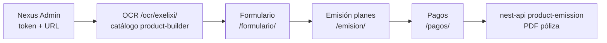

# Flujo Exélixi — Catálogo genérico (cierrelmds)

> **Dominio:** `https://cierrelmds.exelixitech.com`  
> **Estado srv001 (2026-08-04):** OCR → Formulario → Emisión → Pagos en **200 OK** por HTTPS.

---

## 1. Diagrama del flujo



**Regla:** La Mundial RCV/funerario (`?product=rcv`) es **otra rama** — no mezclar con Exélixi catálogo.

---

## 2. Cómo entrar al flujo (3 formas)

### A) Desde Nexus Admin (recomendado)

1. Abrir **https://cierrelmds.exelixitech.com/admin/**
2. Iniciar sesión como admin Nexus.
3. Ir a la **empresa** (ej. La Mundial, `empresaId=5`).
4. En **submódulos activos**, buscar el módulo **Emisión Genérica Exélixi** (OCR catálogo).
5. Copiar la **URL de acceso** (`accessUrl`) — ya incluye `?nexus_token=...`.
6. La URL base del submódulo en BD debe ser: **`/ocr/exelixi/`**

Ejemplo de URL final:

```
https://cierrelmds.exelixitech.com/ocr/exelixi/?nexus_token=eyJhbGciOiJIUzI1NiIs...
```

### B) URL directa (si ya tienes token)

```
https://cierrelmds.exelixitech.com/ocr/exelixi/?nexus_token=TU_TOKEN_AQUI
```

Alternativa equivalente:

```
https://cierrelmds.exelixitech.com/ocr/?flow=exelixi-catalog&nexus_token=TU_TOKEN_AQUI
```

### C) API Nexus — verificar token

```bash
curl -s "https://cierrelmds.exelixitech.com/nexus-api/api/access/verify" \
  -H "Authorization: Bearer TU_TOKEN" | jq .
```

Debe responder `"active": true` y datos de `empresa` + `submodulo`.

---

## 3. Pasos del wizard (usuario)

| Paso | Módulo      | URL (tras bridge)                      | Qué hace                                              |
| ---- | ----------- | -------------------------------------- | ----------------------------------------------------- |
| 1    | OCR Exélixi | `/ocr/exelixi/`                        | Selector productos del **product-builder** (catálogo) |
| 2    | OCR         | ↑                                      | Subir documentos → OCR Gemini                         |
| 3    | Formulario  | `/formulario/?sid=...&nexus_token=...` | Datos cliente / vehículo según producto               |
| 4    | Emisión     | `/emision/?sid=...`                    | Planes vía `product-emission` (nest-api)              |
| 5    | Pagos       | `/pagos/?sid=...`                      | Pago móvil / SyPago → emisión PDF                     |

El **`sid`** lo crea el bridge (`nexus-api` `/api/flow/start-from-token`) al avanzar desde OCR.

---

## 4. Submódulos Nexus (IDs srv001 — referencia)

| Paso        | submoduloId (ejemplo sesión) | Prefijo         |
| ----------- | ---------------------------- | --------------- |
| OCR Exélixi | 17 o 21                      | `/ocr/exelixi/` |
| Formulario  | 18 o 22                      | `/formulario/`  |
| Emisión     | —                            | `/emision/`     |
| Pagos       | 20                           | `/pagos/`       |

Los IDs exactos dependen de la BD Nexus (`submodulo` + `empresa_submodulo`).

---

## 5. Productos piloto en catálogo (OCR)

Configurados en `ocr-api` → `CATALOG_PRODUCT_ALLOWLIST`:

- Automovil Exelixi TEST
- Gastos Funerarios Exelixi TEST
- Accidentes Personales Exelixi TEST

Catálogo vía **product-builder** (`http://127.0.0.1:3015` en srv001).

---

## 6. Verificación rápida (smoke test)

```bash
# Prefijos HTTPS
for p in /ocr/ /ocr/exelixi/ /formulario/ /emision/ /pagos/; do
  echo -n "$p → "; curl -skI "https://cierrelmds.exelixitech.com${p}" | head -1
done

# Catálogo OCR (requiere ocr-api + product-builder-api online)
curl -sf "https://cierrelmds.exelixitech.com/ocr/api/catalog/products" | head -c 200
# Debe ser JSON {"success":true,"products":[...]} — NO HTML de index.html
```

**Si `/ocr/api/*` devuelve HTML:** el fallback SPA de `vite preview` estaba reescribiendo `/ocr/api/` a `index.html`. Fix en `vite-spa-preview.ts` (commit ocr-documentos-modulo). Tras deploy:

```bash
curl -sf "https://cierrelmds.exelixitech.com/ocr/api/health"
# Esperado: {"status":"ok","module":"ocr",...}
```

**409 en `/nexus-api/api/flow/start-from-token`:** normal si entras directo a `/ocr/exelixi/` — el bridge continúa en modo standalone; no bloquea el catálogo.

**Sin valrep La Mundial:** el flujo Exélixi catálogo **no** debe llamar a `/api/valrep/*` (estados/ciudades Sis2000). El front OCR/Formulario usa catálogos locales cuando `exelixi_catalog_flow=1` en sessionStorage. Si ves `GET /ocr/api/valrep/state` en consola, redeploy OCR+Formulario con el fix correspondiente.

En navegador (incógnito):

1. Pegar URL con `nexus_token` en `/ocr/exelixi/`
2. Debe aparecer selector de productos Exélixi (no pantalla RCV La Mundial)
3. Tras OCR → redirección automática a `/formulario/` con `sid` + token

---

## 7. Deploy — reglas VITE_APP_BASE (crítico)

| Módulo     | `VITE_APP_BASE` build  | Script                             |
| ---------- | ---------------------- | ---------------------------------- |
| OCR        | **`/ocr/`** (absoluto) | `bash scripts/build-cierrelmds.sh` |
| Formulario | **`./`** (relativo)    | `bash scripts/build-cierrelmds.sh` |
| Emisión    | **`./`**               | `cd frontend && npm run build`     |
| Pagos      | **`./`**               | `bash scripts/build-cierrelmds.sh` |

**Siempre antes de `pm2 start`:**

```bash
unset PORT VITE_APP_BASE VITE_EMISSION_CONTINUE_BASE DATABASE_URL
```

**Nunca** encadenar builds de varios módulos sin `unset` — contamina `ocr-web` (ej. servir `/formulario/` en puerto 5181).

Ver incidentes: `docs/SRV001-INVENTARIO-Y-INCIDENTES.md` § INC-2026-08-04-C, INC-F.

---

## 8. Documentos relacionados

- `docs/SRV001-MAPA-PUERTOS.md` — puertos PM2 + Apache
- `docs/SRV001-INVENTARIO-Y-INCIDENTES.md` — checklist deploy
- `deploy/APACHE-INFRA-REVISION-PREFIJOS.md` — handoff infra
- `.cursor/rules/03-server-deploy.mdc` — comandos deploy
