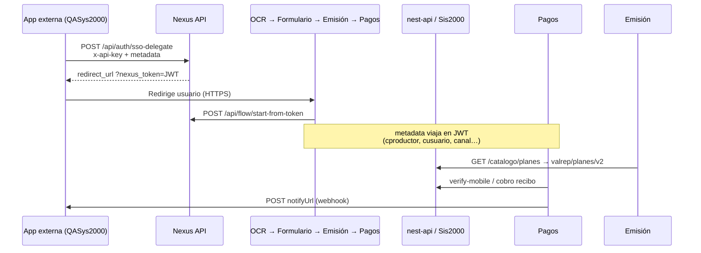

# Integración externa — SSO seguro, flujo RCV y módulo Pagos

> **URLs producción (La Mundial):** prefijo HTTPS `https://cierrelmds.exelixitech.com/`  
> Ver también [INTEGRACION-QASYS2000-HTTPS.md](./INTEGRACION-QASYS2000-HTTPS.md) y [CIERRELMDS-HTTPS-PREFIJOS.md](./CIERRELMDS-HTTPS-PREFIJOS.md).

## ¿Es posible con este sistema seguro?

**Sí.** La integración server-to-server usa:

| Capa                 | Mecanismo                                                                              |
| -------------------- | -------------------------------------------------------------------------------------- |
| Identidad de empresa | Header **`x-api-key`** (API Key única por tenant en Nexus)                             |
| Sesión de usuario    | JWT **`nexus_token`** firmado (`TENANT_TOKEN_SECRET`, expira 1 h)                      |
| Metadata de canal    | Objeto **`metadata`** embebido en el JWT (productor, usuario Sis2000, checkout Pagos…) |
| Rate limit           | `sso-delegate`: 30 req/min por IP                                                      |
| Validación metadata  | Schema Zod en nexus-api (campos desconocidos se descartan)                             |
| Módulos              | Cada backend valida el token en cada request (`nexusAuth`) + heartbeat a Nexus         |

El navegador del usuario **nunca** ve la API Key: solo recibe la `redirect_url` con `?nexus_token=...`.

---

## Arquitectura (RCV completo)



---

## 1. Requisitos previos (Nexus Admin)

1. **Empresa** creada y activa (ej. id `5`).
2. **API Key** (`x-api-key`) entregada al integrador (no compartir en front público).
3. **Submódulos activos** para la empresa: OCR, Formulario, Emisión, Pagos (flujo RCV).
4. Códigos Sis2000 válidos para esa empresa:
   - **`cproductor`**: entero ≥ 1 (obligatorio para planes RCV).
   - **`cusuario`**: código usuario La Mundial.
   - **`ccanalalt_in` / `cscanalalt_in`**: canal alterno (si aplica).

---

## 2. Entrada al flujo RCV — `POST /api/auth/sso-delegate`

**URL:** `https://cierrelmds.exelixitech.com/nexus-api/api/auth/sso-delegate`

### Headers

| Header         | Obligatorio | Descripción                    |
| -------------- | ----------- | ------------------------------ |
| `Content-Type` | Sí          | `application/json`             |
| `x-api-key`    | Sí          | API Key de la empresa en Nexus |

### Body

| Campo          | Obligatorio        | Descripción                                                                                                                                                                                     |
| -------------- | ------------------ | ----------------------------------------------------------------------------------------------------------------------------------------------------------------------------------------------- |
| `target`       | No (default `ocr`) | Primer módulo: `ocr`, `formulario`, `emision`, `pagos`                                                                                                                                          |
| `metadata`     | Recomendado        | Objeto canal Sis2000 (ver abajo)                                                                                                                                                                |
| Campos en raíz | Alternativa        | `cproductor`, `cusuario`, `cramo`, `ctipo`, `ccanalalt_in`, `cscanalalt_in`, `cgestor_in` (Angular legacy). **Strings vacíos en raíz se ignoran**; en `metadata` anidado **no** (ver pitfalls). |

### Metadata RCV (canal / emisión)

```json
{
  "target": "ocr",
  "cproductor": "80080",
  "cusuario": "7",
  "cramo": 18,
  "ccanalalt_in": "27",
  "cscanalalt_in": 0,
  "cgestor_in": "GESTOR-01"
}
```

Equivalente con objeto anidado:

```json
{
  "target": "ocr",
  "metadata": {
    "cproductor": "80080",
    "cusuario": "7",
    "cramo": 18,
    "ccanalalt_in": "27",
    "cscanalalt_in": 0
  }
}
```

### Respuesta 200

```json
{
  "success": true,
  "redirect_url": "https://cierrelmds.exelixitech.com/ocr/?nexus_token=eyJhbGciOiJIUzI1NiIs...",
  "empresa": "Nombre Empresa",
  "modulo": "OCR Documentos"
}
```

Redirigir al usuario a **`redirect_url`** (misma pestaña o iframe según UX).

### Trazabilidad en logs (srv001)

```
ssoDelegate sse {empresaId}/{target}/{submoduloId}
sso-body { ... metadata enviada ... }
```

Ejemplo real de error (empresa 5):

```json
{
  "cproductor": "",
  "cgestor_in": "",
  "ccanalalt_in": "27",
  "cscanalalt_in": 0,
  "cusuario": "7"
}
```

→ `cproductor` vacío provoca fallo en `GET /catalogo/planes` (`cproductor: null` hacia nest-api).

---

## 3. Uso de metadata en módulos

El JWT incluye `empresaId`, `submoduloId` y `metadata`. Cada backend expone `req.nexusMetadata`.

| Módulo      | Uso de metadata                                                                          |
| ----------- | ---------------------------------------------------------------------------------------- |
| **Emisión** | `GET /api/catalogo/planes` → `cproductor` + `cusuario` → `valrep/planes/v2`              |
| **Emisión** | `POST /api/emision` → fusiona metadata en `state.metadataCanal` → emisión Sis2000        |
| **Pagos**   | `checkout` en metadata → monto, reglas, `notifyUrl`                                      |
| **Todos**   | Heartbeat `POST /api/access/heartbeat` renueva sesión (preserva metadata en token nuevo) |

### Campos metadata → Sis2000 (RCV)

| Metadata SSO                    | Uso                                                      |
| ------------------------------- | -------------------------------------------------------- |
| `cproductor`                    | Planes, cotización, emisión (`cproductor` / `citem`)     |
| `cusuario`                      | Usuario emisor en SPs                                    |
| `cramo`                         | Default `18` (automóvil RCV)                             |
| `ctipo`                         | Tipo vehículo (1=particular, 2=rústico…) → filtro planes |
| `ccanalalt_in`, `cscanalalt_in` | Canal alterno en póliza                                  |
| `cgestor_in`                    | Gestor (opcional)                                        |

---

## 4. Módulo Pagos — dos formas de integración

### A) Pagos dentro del flujo RCV (después de Emisión)

No requiere `sso-delegate` adicional: el usuario llega a Pagos con el mismo `nexus_token` / `sid` del bridge Nexus. El monto sale de la cotización/emisión en sesión.

### B) Pagos standalone (solo cobro) — recomendado para apps externas

#### Opción B1 — `sso-delegate` con `target: "pagos"`

**URL:** mismo endpoint SSO.

```json
{
  "target": "pagos",
  "metadata": {
    "checkout": {
      "referenceId": "POL-2026-001",
      "title": "Pago póliza RCV",
      "subtitle": "La Mundial de Seguros",
      "totalVes": 125000.5,
      "totalUsd": 350.0,
      "exchangeRate": 357.14,
      "lines": [
        { "label": "Prima RCV anual", "amountVes": 120000, "amountUsd": 336 }
      ]
    },
    "rules": {
      "requirePayment": true,
      "methods": ["mobile", "otp"],
      "onSuccess": {
        "mode": "webhook",
        "webhookUrl": "https://qasys2000.lamundialdeseguros.com/api/exelixi/pago-callback"
      }
    },
    "payer": {
      "documentType": "V",
      "documentNumber": "12345678",
      "name": "JUAN PEREZ",
      "phone": "04141234567"
    },
    "payload": {
      "notifyUrl": "https://qasys2000.lamundialdeseguros.com/api/exelixi/pago-callback",
      "polizaId": "POL-2026-001",
      "origen": "QASys2000"
    }
  }
}
```

| Campo                        | Obligatorio      | Descripción                                 |
| ---------------------------- | ---------------- | ------------------------------------------- |
| `metadata.checkout.totalVes` | **Sí**           | Monto total en Bs (> 0)                     |
| `metadata.checkout.title`    | **Sí**           | Título en UI Pagos                          |
| `metadata.rules.methods`     | No               | `mobile`, `otp`, `transfer`, `card`         |
| `metadata.payload.notifyUrl` | **Sí** (webhook) | URL HTTPS donde Pagos notifica el resultado |
| `metadata.payer`             | No               | Pre-llenar datos del pagador                |

Respuesta: `redirect_url` apunta al módulo Pagos con checkout embebido en el token.

#### Opción B2 — `POST /api/flow/checkout-link` (server-to-server)

Requiere `x-api-key`. Crea sesión `sid` + URL directa a Pagos (útil si ya conoces `empresaId` y `moduloGroupId`).

```json
{
  "empresaId": 5,
  "moduloGroupId": 1,
  "checkout": {
    "title": "Pago RCV",
    "totalVes": 125000.5
  },
  "rules": { "methods": ["mobile"] },
  "payload": { "notifyUrl": "https://tu-app.com/webhook/pago" }
}
```

Respuesta incluye `checkoutUrl` con `sid` y `nexus_token`.

---

## 5. Webhook de pago (`notifyUrl`)

Tras pago verificado, el front Pagos llama a **pagos-api**:

`POST /api/checkout/notify` (con `Authorization: Bearer nexus_token`)

pagos-api reenvía al **`notifyUrl`** definido en `metadata.payload`:

```json
{
  "event": "payment.completed",
  "status": "paid",
  "referenceId": "POL-2026-001",
  "amountVes": 125000.5,
  "paymentMethod": "mobile",
  "checkout": { "...": "..." },
  "payload": { "polizaId": "POL-2026-001", "origen": "QASys2000" }
}
```

**Requisitos del endpoint cliente:**

- HTTPS (salvo `CHECKOUT_NOTIFY_ALLOW_PRIVATE_HTTP=true` en dev).
- Responder **2xx** para confirmar recepción.
- Idempotente (puede reintentarse).

Swagger Pagos: `{pagos-api}/docs` — sección **Integración SSO / Checkout**.

---

## 6. Swagger / documentación interactiva

| Servicio                                   | URL docs                                                |
| ------------------------------------------ | ------------------------------------------------------- |
| **Nexus API** (SSO, flow, access)          | `https://cierrelmds.exelixitech.com/nexus-api/api-docs` |
| **Pagos API** (verify-mobile, OTP, notify) | `https://cierrelmds.exelixitech.com/pagos-api/docs`     |
| **nest-api**                               | `https://cierrelmds.exelixitech.com/nest-api-docs/docs` |

En Nexus Swagger ver: **Auth → POST /api/auth/sso-delegate**, **Flow → POST /api/flow/checkout-link**, **Access → verify / heartbeat / token**.

---

## 7. Errores frecuentes

| Síntoma                                                 | Causa                                          | Solución                                                 |
| ------------------------------------------------------- | ---------------------------------------------- | -------------------------------------------------------- |
| `PLANES_V2_HTTP` / `cproductor must not be less than 1` | `cproductor: ""` o ausente en metadata         | Enviar entero ≥ 1; no usar string vacío                  |
| `Mixed Content`                                         | Angular HTTPS llama Nexus HTTP                 | Usar URL HTTPS (cierrelmds o sslip.io)                   |
| `401 No autorizado` valrep                              | Token ausente en llamada directa a La Mundial  | Usar cadena Exélixi (emision-api → nest-api)             |
| `nexusMetadata: {}` en emit                             | Token renovado sin metadata o bypass whitelist | Verificar SSO inicial y heartbeat                        |
| Pagos sin monto                                         | Falta `checkout.totalVes` en metadata          | Incluir bloque `checkout` en `sso-delegate` target pagos |

### Pitfall: `cproductor` vacío en `metadata` anidado

`mergeSsoMetadata` **elimina strings vacíos solo si van en la raíz del body**, no dentro de `metadata: { cproductor: "" }`. Preferir:

- Enviar campos en **raíz** del JSON, o
- Omitir `cproductor` si no se conoce (no enviar `""`), o
- Enviar valor numérico válido.

---

## 8. Ejemplo cURL — RCV (QASys2000)

```bash
curl -sS -X POST 'https://cierrelmds.exelixitech.com/nexus-api/api/auth/sso-delegate' \
  -H 'Content-Type: application/json' \
  -H 'x-api-key: SU_API_KEY' \
  -d '{
    "target": "ocr",
    "cproductor": "80080",
    "cusuario": "7",
    "cramo": 18,
    "ccanalalt_in": "27",
    "cscanalalt_in": 0
  }'
```

## 9. Ejemplo cURL — Pagos standalone

```bash
curl -sS -X POST 'https://cierrelmds.exelixitech.com/nexus-api/api/auth/sso-delegate' \
  -H 'Content-Type: application/json' \
  -H 'x-api-key: SU_API_KEY' \
  -d '{
    "target": "pagos",
    "metadata": {
      "checkout": {
        "title": "Pago RCV",
        "totalVes": 125000.50
      },
      "rules": { "methods": ["mobile"] },
      "payload": {
        "notifyUrl": "https://tu-dominio.com/api/pago-callback"
      }
    }
  }'
```

---

## 10. Checklist integrador

- [ ] API Key Nexus en backend (nunca en Angular público).
- [ ] URLs HTTPS en producción.
- [ ] `cproductor` numérico válido en cada SSO RCV.
- [ ] `notifyUrl` HTTPS para Pagos standalone.
- [ ] Probar `redirect_url` en navegador y verificar logs `sso-body` en nexus-api.
- [ ] Confirmar planes en emision-api antes de producción (`GET /catalogo/planes`).
