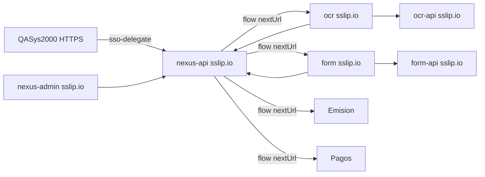

# srv001 — Comunicación HTTPS entre todos los servicios (sslip.io)

IP pública: **200.75.131.138** · IP interna: **192.168.8.120**  
**SysIP-backend no se modifica** (sigue en :3002 HTTP interno).

---

## 1. Prerrequisito infra (obligatorio)

Firewall/NAT debe permitir **desde internet** hacia `192.168.8.120`:

- TCP **80** (validación Let's Encrypt)
- TCP **443** (HTTPS)

Sin esto, Caddy no obtiene certificados y nada se comunica por HTTPS externo.

---

## 2. Mapa de URLs HTTPS

| Servicio    | URL HTTPS                                   | PM2 local |
| ----------- | ------------------------------------------- | --------- |
| Nexus API   | https://nexus-api.200-75-131-138.sslip.io   | :3092     |
| Nexus Admin | https://nexus-admin.200-75-131-138.sslip.io | :5200     |
| OCR API     | https://ocr-api.200-75-131-138.sslip.io     | :4001     |
| OCR web     | https://ocr.200-75-131-138.sslip.io         | :5181     |
| Form API    | https://form-api.200-75-131-138.sslip.io    | :4002     |
| Form web    | https://form.200-75-131-138.sslip.io        | :5182     |
| Pagos API   | https://pagos-api.200-75-131-138.sslip.io   | :4003     |
| Pagos web   | https://pagos.200-75-131-138.sslip.io       | :5184     |
| Emisión API | https://emision-api.200-75-131-138.sslip.io | :4004     |
| Emisión web | https://emision.200-75-131-138.sslip.io     | :5183     |
| RCV API     | https://rcv-api.200-75-131-138.sslip.io     | :3001     |
| RCV web     | https://rcv.200-75-131-138.sslip.io         | :5180     |

Caddyfile: `docs/srv001-caddy-sslip.Caddyfile`

---

## 3. Quién habla con quién



| Origen                            | Destino                        | Variable / mecanismo                          |
| --------------------------------- | ------------------------------ | --------------------------------------------- |
| Navegador (cualquier front HTTPS) | Nexus API                      | `VITE_NEXUS_API_URL` / `VITE_API_URL`         |
| Nexus flow (redirects)            | Módulos OCR→Form→Emisión→Pagos | URLs en BD `submodulo.url`                    |
| Bridge entre módulos              | Nexus `/api/flow/*`            | `VITE_NEXUS_API_URL` + hostname sslip         |
| QASys2000 Angular                 | Nexus SSO                      | URL HTTPS nexus-api sslip                     |
| PM2 → PM2 mismo servidor          | localhost                      | `http://127.0.0.1:PUERTO` (opcional, sin SSL) |

---

## 4. Deploy en srv001 (orden)

### A. Caddy (ya instalado)

```bash
sudo cp ~/nexus-api/docs/srv001-caddy-sslip.Caddyfile /etc/caddy/Caddyfile
sudo systemctl restart caddy
```

Esperar certificados (~2 min). Verificar:

```bash
curl -sI https://nexus-api.200-75-131-138.sslip.io | head -5
```

### B. Nexus API (CORS sslip.io)

```bash
cd ~/nexus-api && git pull && npm run build && pm2 restart nexus-api
```

### C. URLs en base de datos (flujo entre módulos)

```bash
cd ~/nexus-api && node update-urls-sslip.js
```

### D. Rebuild frontends con HTTPS

Variables comunes:

```bash
export NEXUS_HTTPS=https://nexus-api.200-75-131-138.sslip.io
```

**Nexus Admin** (`~/nexus-admin`):

```bash
export VITE_API_URL=$NEXUS_HTTPS
npm run build && pm2 restart nexus-admin
```

**Cada módulo** (frontend antes de build):

```bash
# OCR (~/exelixi/ocr-documentos-modulo/frontend)
export VITE_NEXUS_API_URL=$NEXUS_HTTPS
export VITE_API_URL=https://ocr-api.200-75-131-138.sslip.io
cd frontend && npm run build && pm2 restart ocr-web

# Formulario
export VITE_NEXUS_API_URL=$NEXUS_HTTPS
export VITE_API_URL=https://form-api.200-75-131-138.sslip.io
# ... idem emision, pagos

# RCV (~/auto-casa)
export VITE_NEXUS_API_URL=$NEXUS_HTTPS
npm run build && pm2 restart rcv-web
```

### E. QASys2000 (externo)

```typescript
'https://nexus-api.200-75-131-138.sslip.io/api/auth/sso-delegate';
```

---

## 5. CORS

- **nexus-api**: `*.200-75-131-138.sslip.io` + `*.lamundialdeseguros.com` (`src/config/cors.ts`)
- **Módulos API**: `CORS_ORIGINS=*` por defecto o listar URLs sslip en `.env`

---

## 6. Bridge OCR→Form→Emisión→Pagos

Con HTTPS el puerto del navegador es **443 (vacío)**. Los `bridge.ts` detectan el módulo por **hostname** sslip.io.

---

## 7. Apache detenido

Los vhosts Apache en puertos 81–90 y 3020 quedaron apagados. Si algo los necesita, migrar a Caddy o reactivar Apache solo en puertos altos (no 80/443).
