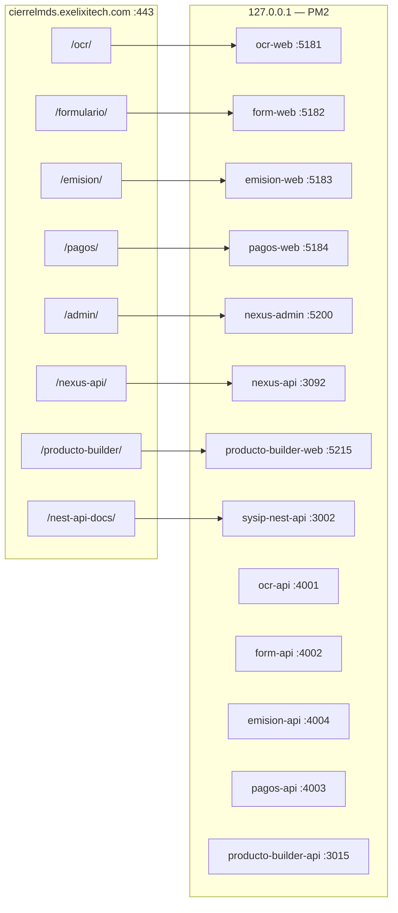

# srv001 — Mapa canónico de puertos y prefijos Apache

> **Fuente de verdad:** prefijos y puertos públicos definidos en Apache (`deploy/apache-cierrelmds-modulos.conf`).  
> **Regla de oro:** no cambiar prefijos Apache ni reasignar puertos ya proxyados sin ejecutar antes el inventario en srv001.  
> **Validación en servidor:** `bash ~/nexus-api/scripts/srv001-inventario-env.sh`

**Última revisión:** 2026-08-04

---

## 1. Diagrama de flujo (HTTPS → Apache → PM2)



**Nota:** las APIs de módulos (4001–4004) no pasan por Apache en producción; el front las llama vía proxy interno del propio módulo o URLs configuradas en `server/.env`.

---

## 2. Tabla maestra (NO modificar columnas Apache / puerto esperado)

| Prefijo Apache           | URL pública               | PM2 web                | Puerto web | PM2 API                | Puerto API | `VITE_APP_BASE` (build) | Carpeta srv001                    |
| ------------------------ | ------------------------- | ---------------------- | ---------- | ---------------------- | ---------- | ----------------------- | --------------------------------- |
| `/ocr/`                  | `…/ocr/`                  | `ocr-web`              | **5181**   | `ocr-api`              | **4001**   | `/ocr/`                 | `~/exelixi/ocr-documentos-modulo` |
| `/formulario/`           | `…/formulario/`           | `form-web`             | **5182**   | `form-api`             | **4002**   | `/formulario/`          | `~/exelixi/Formulario-modulo`     |
| `/emision/`              | `…/emision/`              | `emision-web`          | **5183**   | `emision-api`          | **4004**   | `/emision/`             | `~/exelixi/Emision-Plan-modulo`   |
| `/pagos/`                | `…/pagos/`                | `pagos-web`            | **5184**   | `pagos-api`            | **4003**   | `/pagos/`               | `~/exelixi/Pagos-Poliza-modulo`   |
| `/admin/`                | `…/admin/`                | `nexus-admin`          | **5200**   | —                      | —          | `/admin/`               | `~/nexus-admin`                   |
| `/nexus-api/`            | `…/nexus-api/`            | —                      | —          | `nexus-api`            | **3092**   | —                       | `~/nexus-api`                     |
| `/producto-builder/`     | `…/producto-builder/`     | `producto-builder-web` | **5215**   | `producto-builder-api` | **3015**   | `/producto-builder/`    | `~/producto-builder`              |
| `/producto-builder-api/` | `…/producto-builder-api/` | —                      | —          | ↑                      | **3015**   | —                       | ↑                                 |
| `/nest-api-docs/`        | `…/nest-api-docs/`        | —                      | —          | `sysip-nest-api`       | **3002**   | —                       | `~/server-api-sys`                |

### ProxyPass Apache (fragmento exacto)

```apache
ProxyPass /ocr/         http://127.0.0.1:5181/ocr/
ProxyPass /formulario/  http://127.0.0.1:5182/formulario/
ProxyPass /emision/     http://127.0.0.1:5183/emision/
ProxyPass /pagos/       http://127.0.0.1:5184/pagos/
ProxyPass /admin/       http://127.0.0.1:5200/admin/
ProxyPass /nexus-api/   http://127.0.0.1:3092/
ProxyPass /producto-builder/     http://127.0.0.1:5215/producto-builder/
ProxyPass /producto-builder-api/ http://127.0.0.1:3015/producto-builder-api/
ProxyPass /nest-api-docs/        http://127.0.0.1:3002/
```

Archivo completo: `exelixi-nexus-services/deploy/apache-cierrelmds-modulos.conf`

---

## 3. Proyecto aislado — Auto Casa RCV (NO mezclar con módulos Exélixi)

| PM2       | Puerto   | Uso                   | Conflicto si se reutiliza      |
| --------- | -------- | --------------------- | ------------------------------ |
| `rcv-api` | **3001** | API NestJS Auto Casco | ❌ **pagos-api nunca en 3001** |
| `rcv-web` | **5180** | Front RCV             | ❌ **pagos-web nunca en 5180** |

RCV **no** aparece en el vhost `cierrelmds` de módulos La Mundial; acceso directo por puerto o vhost distinto.

---

## 4. Puertos reservados — resumen rápido

| Puerto | Servicio esperado      | Prohibido usar para                                    |
| ------ | ---------------------- | ------------------------------------------------------ |
| 3001   | `rcv-api`              | pagos-api, emision-api, OCR                            |
| 3002   | `sysip-nest-api`       | cualquier otro PM2                                     |
| 3015   | `producto-builder-api` | ocr-api (catálogo va por URL, no puerto compartido)    |
| 3092   | `nexus-api`            | OCR/form tras `source nexus-api/.env` sin `unset PORT` |
| 4001   | `ocr-api`              | —                                                      |
| 4002   | `form-api`             | —                                                      |
| 4003   | `pagos-api`            | **no 3001**                                            |
| 4004   | `emision-api`          | —                                                      |
| 5180   | `rcv-web`              | **pagos-web, ocr-web**                                 |
| 5181   | `ocr-web`              | producto-builder                                       |
| 5182   | `form-web`             | —                                                      |
| 5183   | `emision-web`          | —                                                      |
| 5184   | `pagos-web`            | **no 5180**                                            |
| 5200   | `nexus-admin`          | —                                                      |
| 5215   | `producto-builder-web` | ocr-web                                                |

---

## 5. Verificación en srv001 (solo lectura — no cambia nada)

```bash
# Inventario completo + cruce mapa vs PM2 vs puertos en escucha
bash ~/nexus-api/scripts/srv001-inventario-env.sh | tee ~/srv001-inventario-$(date +%F-%H%M).txt

# Puertos críticos en una línea
ss -tlnp | grep -E ':3001|:3002|:3015|:3092|:4001|:4002|:4003|:4004|:5180|:5181|:5182|:5183|:5184|:5200|:5215'

# Prefijos HTTPS (debe ser 200, no 302 a producto-builder)
for p in /ocr/ /formulario/ /emision/ /pagos/ /admin/; do
  echo -n "$p → "
  curl -skI "https://cierrelmds.exelixitech.com${p}" | head -1
done
```

### Criterios OK

| Check               | Esperado                                      |
| ------------------- | --------------------------------------------- |
| `ocr-web` escucha   | `:5181`                                       |
| `pagos-web` escucha | `:5184` (no `:5180`)                          |
| `pagos-api` PORT    | `4003` (no `3001`)                            |
| `curl :5181/ocr/`   | HTML OCR, no mensaje Vite de producto-builder |
| HTTPS `/ocr/`       | HTTP 200, sin `Location: /producto-builder/`  |

---

## 6. Si hay desalineación: qué corregir y qué NO tocar

| Situación                           | Acción correcta                                                                       | NO hacer                                |
| ----------------------------------- | ------------------------------------------------------------------------------------- | --------------------------------------- |
| PM2 usa puerto distinto al mapa     | Ajustar `ecosystem.config.js` del **repo** del módulo → pull → `pm2 delete` + `start` | Cambiar ProxyPass Apache                |
| Front compilado con base incorrecta | Rebuild con `VITE_APP_BASE` de la tabla §2                                            | Editar `.env.production` solo en srv001 |
| `pagos-api` en 3001                 | Redeploy con PORT **4003**                                                            | Mover rcv-api a otro puerto             |
| `pagos-web` en 5180                 | Redeploy con preview **5184**                                                         | Cambiar Apache `/pagos/` a 5180         |
| Shell con `PORT=3092`               | `unset PORT` antes de reload módulos                                                  | `pm2 restart --update-env` post-nexus   |

---

## 7. Repos locales ↔ carpetas srv001

| Repo GitHub (workspace local) | Carpeta en srv001                 |
| ----------------------------- | --------------------------------- |
| `ocr-documentos-modulo`       | `~/exelixi/ocr-documentos-modulo` |
| `Formulario-modulo`           | `~/exelixi/Formulario-modulo`     |
| `Emision-Plan-modulo`         | `~/exelixi/Emision-Plan-modulo`   |
| `Pagos-Poliza-modulo`         | `~/exelixi/Pagos-Poliza-modulo`   |
| `exelixi-nexus-services`      | `~/nexus-api`                     |
| `exelixi-nexus`               | `~/nexus-admin`                   |
| `server-api-sys`              | `~/server-api-sys`                |
| `producto-builder`            | `~/producto-builder`              |
| `auto-casa-inspeccion`        | `~/auto-casa`                     |

**No usar** rutas legacy `~/modulo-ocr`, `~/modulo-formulario`, etc.

---

## 8. Documentos relacionados

- `docs/SRV001-INVENTARIO-Y-INCIDENTES.md` — incidentes y checklist deploy
- `docs/CIERRELMDS-HTTPS-PREFIJOS.md` — guía HTTPS
- `.cursor/rules/03-server-deploy.mdc` — comandos deploy por repo
- `scripts/srv001-inventario-env.sh` — script de inventario
